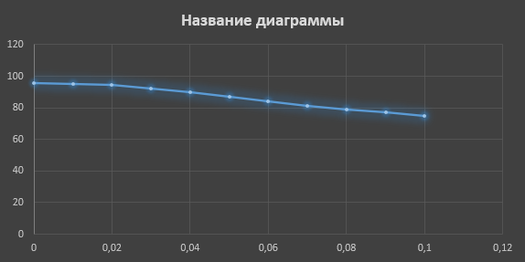
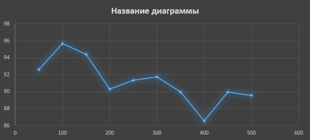
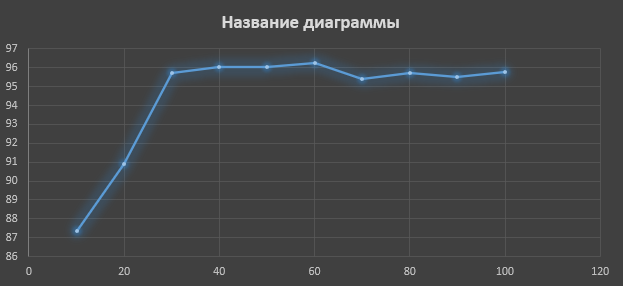

## Комп'ютерні системи імітаційного моделювання
## СПм-22-3, **Захаров Даніїл Олександрович**
### Лабораторна робота №**1**. Опис імітаційних моделей та проведення обчислювальних експериментів

 

### Варіант 9, модель у середовищі NetLogo:
[Sheperds](http://www.netlogoweb.org/launch#http://www.netlogoweb.org/assets/modelslib/Sample%20Models/Biology/Shepherds.nlogo)

 

### Вербальний опис моделі:
У цьому проекті вівці безладно блукають, а пастухи ходять, намагаючись їх випасати. Чи опиняться вівці в одному стаді, залежить від кількості пастухів і від того, наскільки швидко вони рухаються порівняно з вівцями. Кожен пастух блукає випадковим чином і якщо він натикається на вівцю, він підбирає вівцю та продовжує безладно блукати. Коли він натикається на іншу вівцю, він знаходить вільне місце поблизу, кладе свою вівцю та шукає іншу.

### Керуючі параметри:
- **num-shepherds** визначає кількість пастухів на полі.
- **num-sheep** визначає кількість овець на полі.
- **sheep-speed** визначає швидкість руху овець, тобто, кількість ділянок на які вівця перисунеться, на кожному ігровому такті, в випадковому напрямі.

### Внутрішні параметри:
- **sheepless-neighborhoods**. Значення сусідніх ділянок без овець
- **herding-efficiency**. Вимірює, наскільки ефективно згруповані вівці

### Показники роботи системи:
- **herding-efficiency**, тобто ефективність роботи пастухів. Ефективність утримання стада вимірюється тут шляхом підрахунку кількості ділянок, у яких немає овець:
ефективність = ділянки без овець / (кількість ділянок - кількість овець). 
Виражено у відсотках.

### Примітки:
При налаштуваннях за замовченням, візуально відилити наявність стада, або декількох окремих стад, можно при ефективності вище 89%.

### Недоліки моделі:
"Інтелект" пастухів складно порівняти з реальним світом. Пастухи пересуваються хаотично, іноді забирають овець із наявних стад, та навіть не мають можливості візначити, що таке стадо та де воно.

 

## Обчислювальні експерименти
### 1. Вплив швидкості руху овець на ефективність групування
Досліджується залежність ефективності групування від швидкості руху овець. Експерименти проводяться при 30 пастухах, з 150 вівцями, усього 11 симуляцій, крок зміни швидкості 0.01, кожна ітерація триває 5000 тактів.
Для створення умов початку експерименту виставимо швидкість 0, тобто вівці не рухаються, і очікуємо момент коли утворится одна группа овець (при цьому ефективність становіть приблизно 95%), після цього можно проводити експеримент і ітеративно збільшувати швидкість. 

Статичні параметри:
- **num-shepherds**: 30
- **num-sheep**: 150

<table>
<thead>
<tr><th>Швидкості руху овець</th><th>Ефективності групування</th></tr>
</thead>
<tbody>
<tr><td>0</td><td>95,488</td></tr>
<tr><td>0,01</td><td>95,331</td></tr>
<tr><td>0,02</td><td>94,360</td></tr>
<tr><td>0,03</td><td>92,347</td></tr>
<tr><td>0,04</td><td>90,068</td></tr>
<tr><td>0,05</td><td>87,224</td></tr>
<tr><td>0,06</td><td>84,321</td></tr>
<tr><td>0,07</td><td>81,529</td></tr>
<tr><td>0,08</td><td>79,039</td></tr>
<tr><td>0,09</td><td>77,243</td></tr>
<tr><td>0,1</td><td>74,672</td></tr>
</tbody>
</table>

Графік наочно показує, що зі збльшенням швидкості руху овець пастухам стає складніше підтримувати стада. І при швидкості 0,1 від пастухів вже не має користі.

### 2. Вплив кількості овець на ефективність групування
Досліджується залежність ефективності групування овець від їх кількості. Експерименти проводяться при 30 пастухах та швидкості 0,02, усього 10 симуляцій, крок зміни кількості 50 голов, кожна ітерація триває 5000 тактів.

Статичні параметри:
- **num-shepherds**: 30
- **sheep-speed**: 0,02

<table>
<thead>
<tr><th>Кількість овець</th><th>Ефективності групування (макс.)</th></tr>
</thead>
<tbody>
<tr><td>50</td><td>92,645</td></tr>
<tr><td>100</td><td>95,698</td></tr>
<tr><td>150</td><td>94,4</td></tr>
<tr><td>200</td><td>90,316</td></tr>
<tr><td>250</td><td>91,346</td></tr>
<tr><td>300</td><td>91,731</td></tr>
<tr><td>350</td><td>89,987</td></tr>
<tr><td>400</td><td>86,547</td></tr>
<tr><td>450</td><td>89,936</td></tr>
<tr><td>500</td><td>89,543</td></tr>
</tbody>
</table>

Графік наочно показує, що зі збльшенням кількості овець пастухам стає складніше підтримувати стада, але збільшена кількість овець іноді призводить до мимовільного утворення стад.

### 3. Вплив кількості пастухів на ефективність групування

Досліджується залежність ефективності групування від кількості пастухів. Експерименти проводяться при 150 вівцях та швидкості 0,02, усього 10 симуляцій, крок зміни кількості 10 пастухів, кожна ітерація триває 5000 тактів.

Статичні параметри:
- **num-sheep**: 150
- **sheep-speed**: 0,02

<table>
<thead>
<tr><th>Кількість пастухів</th><th>Ефективності групування (макс.)</th></tr>
</thead>
<tbody>
<tr><td>10</td><td>87,343</td></tr>
<tr><td>20</td><td>90,89</td></tr>
<tr><td>30</td><td>95,702</td></tr>
<tr><td>40</td><td>96,02</td></tr>
<tr><td>50</td><td>96,033</td></tr>
<tr><td>60</td><td>96,233</td></tr>
<tr><td>70</td><td>95,421</td></tr>
<tr><td>80</td><td>95,707</td></tr>
<tr><td>90</td><td>95,506</td></tr>
<tr><td>100</td><td>95,762</td></tr>
</tbody>
</table>

Графік наочно показує, що зі збльшенням кількості овець пастухам стає легче підтримувати стада, але при великій кількості, пастухи роблять багато зайвих перисувань овець, що знижуе ефективність.

